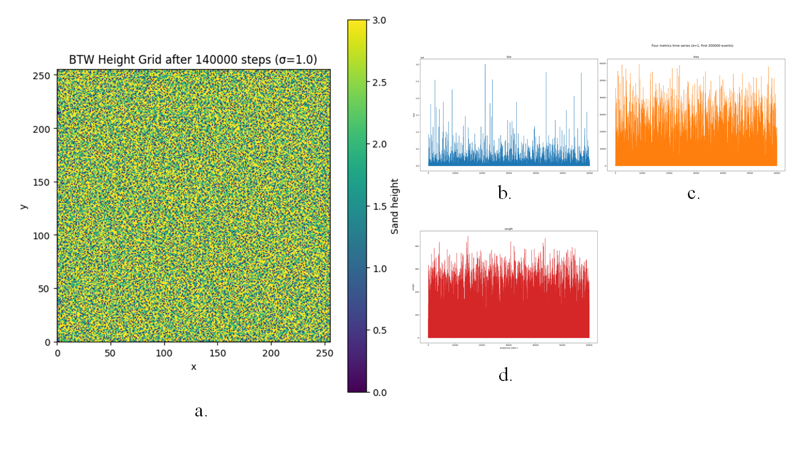
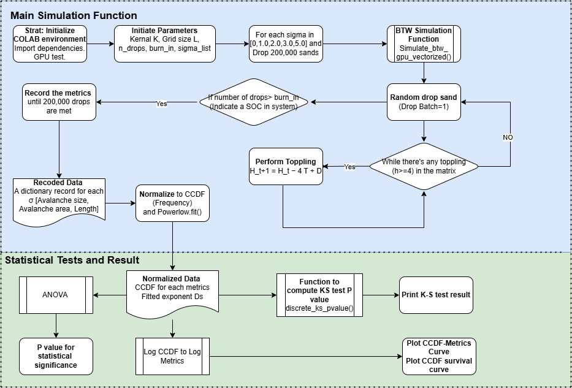
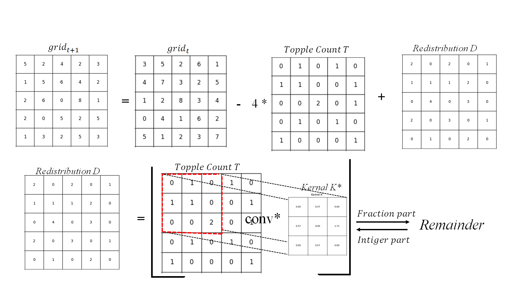
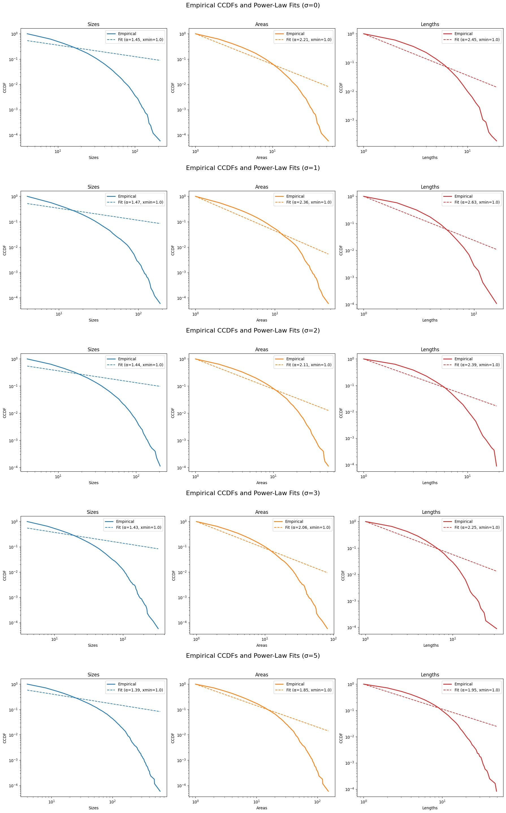

# GPU-Accelerated Sandpile Model Simulation (Colab Ready)

## Overview
This repository contains a **Google Colab / Jupyter Notebook** for simulating the **Bak–Tang–Wiesenfeld (BTW) sandpile model** with GPU acceleration using PyTorch.  
It supports:
- Large grid sizes (e.g., 256×256)
- **Wind bias** via a tunable parameter σ
- **Mass conservation** with fractional–integer grain accumulation
- Avalanche statistics and **power-law** analysis

The notebook can be opened directly in Google Colab, allowing you to run experiments without local setup.
---

## Run in Colab
Click the badge below to launch the notebook in Colab:

[]([YOUR_COLAB_LINK_HERE](https://colab.research.google.com/drive/1E-kk3P6QeptgWi4oLvbTIFaysJBjhbe5))

---

## Features
- **Self-organized criticality**: The simulation evolves naturally to a critical state without fine-tuning.
- **Wind-biased kernel**: Models directional driving forces via σ.
- **Fully GPU-accelerated**: Fast relaxation steps via `torch.nn.functional.conv2d`.
- **Interactive parameters**: Change grid size, number of drops, burn-in period, σ, and see immediate results.
- **Built-in visualization**:
  - Heatmap of final stable configuration
  - Power-law distribution plots for avalanche size/duration
  - K–S test statistics

---

## How to Use
1. **Open in Colab** (no installation required)  
   or  
   **Clone and run locally**:
   ```bash
   git clone https://github.com/yourusername/sandpile_colab.git
   cd sandpile_colab
   pip install -r requirements.txt
   jupyter notebook
   ```
2. **In the notebook:**
Set simulation parameters in the first cell:
  ```python
  L = 256          # grid size
  n_drops = 200000 # number of grains dropped
  burn_in = 140000 # start recording after this many drops
  sigma = 2.0      # wind bias strength.
   ```
## Programme design and flowchart


## Mathematical Background

At each step, the model updates according to the following rules:

1. **Topple count**:

$$
T_{i,j} = \left\lfloor \frac{\mathrm{grid}_{i,j}}{4} \right\rfloor
$$

This represents the number of toppling events at site \((i,j)\).

2. **Redistribution**:

$$
D = \left\lfloor \mathrm{conv2d}(T, K^*, \mathrm{padding}=1) \right\rfloor
$$

where \(K^*\) is the wind-biased redistribution kernel.

3. **Grid update**:

$$
\mathrm{grid}_{t+1} = \mathrm{grid}_t - 4T + D
$$

ensuring **mass conservation** except for grains lost at the boundaries.

### Wind-biased kernel

$$
K^* =
\begin{pmatrix}
0 & w_{\mathrm{base}} & 0 \\
 w_{\mathrm{base}} & 0 & w_{\mathrm{right}} \\
0 & w_{\mathrm{base}} & 0
\end{pmatrix}, \quad
w_{\mathrm{base}} = \frac{4}{4+\sigma}, \quad
w_{\mathrm{right}} = \frac{4\sigma}{4+\sigma}
$$

The parameter \(\sigma\) controls the **strength of the wind bias**, increasing redistribution toward the right neighbor.

---

## Example Output

- **Sandpile State**
- **Avalanche Size Distribution**
  
---

## File Structure

```
├── sandpile_simulation.ipynb   # Main Colab/Notebook file
├── requirements.txt            # Dependencies
├── figs/                        # Example output plots
└── README.md                    # This document
```

---

## License

MIT License — see [LICENSE](LICENSE) for details.
